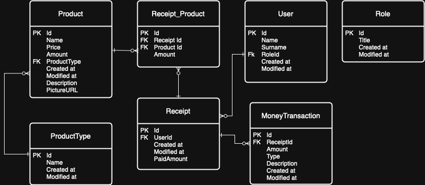

# SaleManager
This project was developed by Platon Matsinski as part of the Enefit internship selection process.

## Requirements

- .NET 8.0 SDK or newer
- PostgreSQL database

## Installation
### 1. Clone the repository
### 2. Configure the database
The project comes with preconfigured connection strings in appsettings.json and appsettings.Development.json:

    "ConnectionStrings": {
        "DefaultConnection": "Host=db;Database=bakesale;Username=postgres;Password=postgres",
        "LocalConnection": "Host=localhost;Database=bakesale;Username=postgres;Password=postgres"
    }
You can use the LocalConnection for development, or modify it based on your PostgreSQL configuration.

### 3. Apply migrations
    cd WebApp
    dotnet ef database update
    or dotnet ef database update --project DAL  (from SaleManagerHW folder)
### 4. Run the application
    dotnet run
### 5. Browser
In your browser go to http://localhost:5052

## Using

### Default Users
When the application runs for the first time, the following default users are created:

- Administrator:
  - Login: admin
  - Name: Admin User
  - Permissions: Full access to all features including product management, sales, returns, and reporting

- Regular User:
  - Login: user
  - Name: Regular User
  - Permissions: Can create and manage only open receipts, make sales.

### Default Product Types
The system uses the following product types by default:

- Food
- Drinks
- Clothing

When importing products, make sure to use these product type IDs.

### Import from file
You can import from file products confugurations. For that you can use a default config file or load your own. An example json file is given. if you would like, you can olso modify default config file, that is located WebApp/Config/products.json

## Project Structure

### WebApp
- ApiControllers
- Pages
- Config
### BLL
- DTO
- Mappers
- Services
- Exceptions
### DAL
- Context
- Seeding
### Domain
- Entities

## Swagger
API dokumentatsioon on kättesaadav Swagger UI kaudu:
  http://localhost:5052/Swagger/

## Entity Diagram

